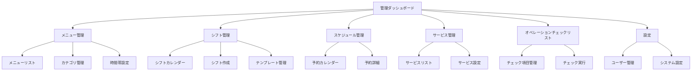

## 1. 製品概要
Cotoka Bookingの管理画面にメニュー管理機能を追加し、シフト管理のUIを他の管理画面と統一することで、管理者の操作性と一貫性を向上させる。美容室・理容室向けの予約管理システムの管理機能を強化する。

## 2. コア機能

### 2.1 ユーザーロール

| ロール | 登録方法 | コア権限 |
|------|----------|----------|
| 管理者 | 初期設定時に作成 | 全機能へのアクセス、ユーザー管理、システム設定 |
| スタッフ | 管理者による招待 | 自身のシフト確認、スケジュール閲覧、限定された管理機能 |

### 2.2 機能モジュール

本システムの要件は以下の主要ページで構成される：

1. **管理ダッシュボード**: ナビゲーション、概要表示、重要な通知
2. **メニュー管理ページ**: メニュー項目のCRUD操作、価格設定、カテゴリ管理、提供時間帯設定
3. **シフト管理ページ**: シフトカレンダー、スタッフ別表示、繰り返し設定、テンプレート管理
4. **スケジュール管理ページ**: 予約カレンダー、顧客情報、サービス詳細
5. **サービス管理ページ**: 提供サービスの設定、所要時間管理、有効/無効切り替え
6. **オペレーションチェックリスト**: 業務チェック項目の管理、完了状態の追跡
7. **設定ページ**: ユーザー管理、システム設定、営業時間設定

### 2.3 ページ詳細

| ページ名 | モジュール名 | 機能説明 |
|-----------|-------------|---------------------|
| 管理ダッシュボード | ナビゲーションバー | 全管理機能へのリンクを提供、現在のページをハイライト表示 |
| 管理ダッシュボード | 概要ダッシュボード | 本日の予約数、来週のシフト状況、未確認のチェックリスト項目を表示 |
| 管理ダッシュボード | 通知エリア | 重要なアラート、期限切れの予約、シフトの未設定警告を表示 |
| メニュー管理 | メニューリスト | メニュー項目を一覧表示、検索・フィルタリング機能、ソート機能を提供 |
| メニュー管理 | メニュー追加/編集 | 名前、説明、価格、所要時間、カテゴリ、提供時間帯を設定、バリデーション機能付き |
| メニュー管理 | カテゴリ管理 | カテゴリの作成・編集・削除、並び順の調整、カテゴリ別表示機能 |
| メニュー管理 | 提供時間帯設定 | 朝・昼・夕・夜の時間帯ごとに提供可否を設定、営業時間との連動 |
| シフト管理 | シフトカレンダー | 月/週/日表示モード、スタッフ別表示、ドラッグ&ドロップ編集、重複チェック |
| シフト管理 | シフト作成 | スタッフ選択、日付・時間設定、繰り返しパターン設定、テンプレート適用 |
| シフト管理 | シフトテンプレート | 定型シフトパターンの作成・編集、週次・月次の繰り返し設定、一括適用機能 |
| シフト管理 | スタッフ別表示 | スタッフごとのシフト一覧、勤務時間集計、休日設定との連動 |
| スケジュール管理 | 予約カレンダー | 月/週/日表示、時間帯別表示、予約詳細ポップアップ、顧客情報リンク |
| スケジュール管理 | 予約詳細 | 顧客情報、選択サービス、所要時間、料金、特記事項、キャンセル処理 |
| サービス管理 | サービスリスト | 提供サービスの一覧、有効/無効切り替え、所要時間と料金の表示 |
| サービス管理 | サービス設定 | サービス名、説明、所要時間、追加料金、メニューとの関連付け |
| オペレーションチェックリスト | チェック項目管理 | 業務チェック項目の作成・編集、カテゴリ分類、重要度設定、期限設定 |
| オペレーションチェックリスト | チェック実行 | チェック項目の完了/未完了切り替え、コメント追加、完了履歴の表示 |
| 設定 | ユーザー管理 | ユーザー一覧、ロール設定、アカウント有効/無効、パスワードリセット |
| 設定 | システム設定 | 営業時間設定、定休日設定、予約受付設定、通知設定 |

## 3. コアプロセス

### 管理者フロー
管理ダッシュボードにログイン後、ナビゲーションバーから目的の管理機能を選択する。メニュー管理では、新規メニューを追加する際にカテゴリを選択し、価格と所要時間を設定し、提供可能な時間帯を指定する。既存メニューの編集・削除も同様の手順で実行可能。シフト管理では、カレンダー上でスタッフのシフトを作成・編集し、必要に応じてテンプレートを適用して繰り返しシフトを設定する。

### スタッフフロー
スタッフは自身のシフトを確認し、スケジュールを閲覧できる。管理者から付与された権限に応じて、限定された管理機能にアクセス可能。

## 4. ユーザーインターフェース設計

### 4.1 デザインスタイル

- **プライマリカラー**: #3B82F6（青）- 主要なアクションボタン、リンク、ハイライト
- **セカンダリカラー**: #6B7280（グレー）- 補助要素、境界線、無効状態
- **成功カラー**: #10B981（緑）- 成功メッセージ、完了ステータス
- **警告カラー**: #F59E0B（オレンジ）- 警告メッセージ、注意喚起
- **エラーカラー**: #EF4444（赤）- エラーメッセージ、削除アクション

- **ボタンスタイル**: 角丸（8px）デザイン、ホバー時にシャドウ効果、プライマリボタンは塗りつぶし、セカンダリボタンはアウトライン
- **フォント**: Noto Sans JP、基本サイズ16px、見出しは24-32px、小文字は14px
- **レイアウトスタイル**: カードベース、グリッドレイアウト、レスポンシブデザイン
- **アイコンスタイル**: Heroicons、線画スタイル、統一された太さとサイズ

### 4.2 ページデザイン概要

| ページ名 | モジュール名 | UI要素 |
|-----------|-------------|-------------|
| 管理ダッシュボード | ナビゲーションバー | 左サイドバー配置、ロゴ、メニュー項目、現在位置のハイライト、折りたたみ機能 |
| 管理ダッシュボード | 概要ダッシュボード | カード型ウィジェット、統計数値の大きな表示、グラフ要素、色分けされたステータス |
| メニュー管理 | メニューリスト | テーブル形式、行のホバー効果、編集・削除アイコン、ステータスバッジ、ページネーション |
| メニュー管理 | メニュー編集モーダル | オーバーレイ表示、入力フィールドのバリデーション、保存・キャンセルボタン、ドラフト自動保存 |
| シフト管理 | シフトカレンダー | 月表示グリッド、時間軸表示、ドラッグ&ドロップ機能、カラーコーディング、ツールチップ |
| シフト管理 | シフト作成フォーム | インラインフォーム、日付ピッカー、時間選択ドロップダウン、繰り返し設定オプション |
| スケジュール管理 | 予約カレンダー | 時間帯別表示、予約ブロックの色分け、顧客名表示、所要時間の視覚的表現 |
| 設定 | ユーザー管理 | データテーブル、フィルタリング機能、一括操作チェックボックス、確認ダイアログ |

### 4.3 レスポンシブ対応

デスクトップファースト設計で、画面幅768px以上で最適な表示、タブレット（768px-1024px）ではサイドバーを折りたたみ式に、モバイル（768px未満）ではハンバーガーメニューと縦スクロール最適化。タッチ操作に対応した大きなクリック領域と、スワイプジェスチャー対応。