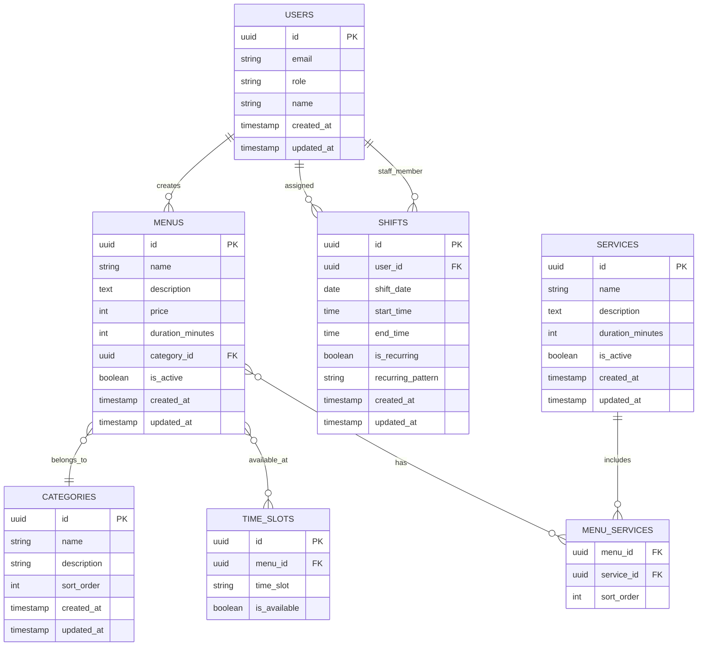

## 1. アーキテクチャ設計


## 2. 技術説明

- **フロントエンド**: Next.js@14 + TypeScript + Tailwind CSS
- **初期化ツール**: create-next-app
- **バックエンド**: Supabase（BaaS）
- **データベース**: Supabase PostgreSQL
- **認証**: Supabase Auth
- **ファイルストレージ**: Supabase Storage

## 3. ルート定義

| ルート | 目的 |
|-------|---------|
| /admin | 管理画面ダッシュボード、全管理機能へのナビゲーション |
| /admin/menus | メニュー管理ページ、メニュー項目のCRUD操作 |
| /admin/menus/categories | カテゴリ管理ページ、メニューカテゴリの管理 |
| /admin/shifts | シフト管理ページ、シフトカレンダーと作成・編集機能 |
| /admin/shifts/templates | シフトテンプレート管理ページ、定型シフトパターンの管理 |
| /admin/schedules | スケジュール管理ページ、予約カレンダーと顧客情報 |
| /admin/services | サービス管理ページ、提供サービスの管理 |
| /admin/checklists | オペレーションチェックリストページ、業務チェック項目の管理 |
| /admin/settings | 設定ページ、ユーザー管理とシステム設定 |

## 4. API定義

### 4.1 メニュー管理API

```
GET /api/admin/menus
```

レスポンス:
| パラメータ名 | パラメータ型 | 説明 |
|-----------|-------------|-------------|
| menus | Menu[] | メニュー項目の配列 |
| categories | Category[] | カテゴリの配列 |

```
POST /api/admin/menus
```

リクエスト:
| パラメータ名 | パラメータ型 | 必須 | 説明 |
|-----------|-------------|-------------|-------------|
| name | string | true | メニュー名 |
| description | string | false | メニューの説明 |
| price | number | true | 価格（円） |
| duration | number | true | 所要時間（分） |
| category_id | string | true | カテゴリID |
| available_time_slots | string[] | true | 提供可能時間帯 |

```
PUT /api/admin/menus/:id
```

```
DELETE /api/admin/menus/:id
```

### 4.2 シフト管理API

```
GET /api/admin/shifts
```

クエリパラメータ:
| パラメータ名 | パラメータ型 | 説明 |
|-----------|-------------|-------------|
| start_date | string | 開始日（YYYY-MM-DD） |
| end_date | string | 終了日（YYYY-MM-DD） |
| staff_id | string | スタッフID（オプション） |

```
POST /api/admin/shifts
```

リクエスト:
| パラメータ名 | パラメータ型 | 必須 | 説明 |
|-----------|-------------|-------------|-------------|
| staff_id | string | true | スタッフID |
| start_time | string | true | 開始時刻（HH:mm） |
| end_time | string | true | 終了時刻（HH:mm） |
| date | string | true | シフト日付（YYYY-MM-DD） |
| is_recurring | boolean | false | 繰り返し設定フラグ |

## 5. サーバーアーキテクチャ図


## 6. データモデル

### 6.1 データモデル定義



### 6.2 データ定義言語

ユーザーテーブル（users）
```sql
-- テーブル作成
CREATE TABLE users (
    id UUID PRIMARY KEY DEFAULT gen_random_uuid(),
    email VARCHAR(255) UNIQUE NOT NULL,
    password_hash VARCHAR(255) NOT NULL,
    name VARCHAR(100) NOT NULL,
    role VARCHAR(20) DEFAULT 'staff' CHECK (role IN ('admin', 'staff')),
    is_active BOOLEAN DEFAULT true,
    created_at TIMESTAMP WITH TIME ZONE DEFAULT NOW(),
    updated_at TIMESTAMP WITH TIME ZONE DEFAULT NOW()
);

-- インデックス作成
CREATE INDEX idx_users_email ON users(email);
CREATE INDEX idx_users_role ON users(role);
```

カテゴリテーブル（categories）
```sql
-- テーブル作成
CREATE TABLE categories (
    id UUID PRIMARY KEY DEFAULT gen_random_uuid(),
    name VARCHAR(100) NOT NULL,
    description TEXT,
    sort_order INTEGER DEFAULT 0,
    created_at TIMESTAMP WITH TIME ZONE DEFAULT NOW(),
    updated_at TIMESTAMP WITH TIME ZONE DEFAULT NOW()
);

-- 初期データ挿入
INSERT INTO categories (name, description, sort_order) VALUES
('カット', 'ヘアカット関連のメニュー', 1),
('カラー', 'ヘアカラー関連のメニュー', 2),
('パーマ', 'パーマ関連のメニュー', 3),
('トリートメント', 'トリートメント関連のメニュー', 4);
```

メニューテーブル（menus）
```sql
-- テーブル作成
CREATE TABLE menus (
    id UUID PRIMARY KEY DEFAULT gen_random_uuid(),
    name VARCHAR(200) NOT NULL,
    description TEXT,
    price INTEGER NOT NULL CHECK (price >= 0),
    duration_minutes INTEGER NOT NULL CHECK (duration_minutes > 0),
    category_id UUID REFERENCES categories(id),
    is_active BOOLEAN DEFAULT true,
    created_at TIMESTAMP WITH TIME ZONE DEFAULT NOW(),
    updated_at TIMESTAMP WITH TIME ZONE DEFAULT NOW()
);

-- インデックス作成
CREATE INDEX idx_menus_category ON menus(category_id);
CREATE INDEX idx_menus_active ON menus(is_active);
CREATE INDEX idx_menus_price ON menus(price);
```

提供時間帯テーブル（menu_time_slots）
```sql
-- テーブル作成
CREATE TABLE menu_time_slots (
    id UUID PRIMARY KEY DEFAULT gen_random_uuid(),
    menu_id UUID REFERENCES menus(id) ON DELETE CASCADE,
    time_slot VARCHAR(20) NOT NULL CHECK (time_slot IN ('morning', 'afternoon', 'evening', 'night')),
    is_available BOOLEAN DEFAULT true,
    created_at TIMESTAMP WITH TIME ZONE DEFAULT NOW()
);

-- 複合インデックス
CREATE UNIQUE INDEX idx_menu_time_slot ON menu_time_slots(menu_id, time_slot);
```

シフトテーブル（shifts）
```sql
-- テーブル作成
CREATE TABLE shifts (
    id UUID PRIMARY KEY DEFAULT gen_random_uuid(),
    user_id UUID REFERENCES users(id),
    shift_date DATE NOT NULL,
    start_time TIME NOT NULL,
    end_time TIME NOT NULL,
    is_recurring BOOLEAN DEFAULT false,
    recurring_pattern VARCHAR(50),
    created_at TIMESTAMP WITH TIME ZONE DEFAULT NOW(),
    updated_at TIMESTAMP WITH TIME ZONE DEFAULT NOW()
);

-- インデックス作成
CREATE INDEX idx_shifts_user ON shifts(user_id);
CREATE INDEX idx_shifts_date ON shifts(shift_date);
CREATE INDEX idx_shifts_user_date ON shifts(user_id, shift_date);
```

### 6.3 Supabase Row Level Security (RLS) ポリシー

```sql
-- メニューテーブルのRLSポリシー
ALTER TABLE menus ENABLE ROW LEVEL SECURITY;

-- 全員がメニューを閲覧可能（anonロール）
CREATE POLICY "Anyone can view menus" ON menus
    FOR SELECT USING (is_active = true);

-- 管理者のみがメニューを管理可能（authenticatedロール）
CREATE POLICY "Admins can manage menus" ON menus
    FOR ALL USING (
        auth.uid() IN (
            SELECT id FROM users WHERE role = 'admin'
        )
    );

-- シフトテーブルのRLSポリシー
ALTER TABLE shifts ENABLE ROW LEVEL SECURITY;

-- スタッフと管理者が自身のシフトを閲覧可能
CREATE POLICY "Users can view own shifts" ON shifts
    FOR SELECT USING (
        user_id = auth.uid() OR
        auth.uid() IN (
            SELECT id FROM users WHERE role = 'admin'
        )
    );

-- 管理者のみがシフトを管理可能
CREATE POLICY "Admins can manage shifts" ON shifts
    FOR ALL USING (
        auth.uid() IN (
            SELECT id FROM users WHERE role = 'admin'
        )
    );

-- 権限の付与
GRANT SELECT ON menus TO anon;
GRANT ALL ON menus TO authenticated;
GRANT SELECT ON shifts TO authenticated;
GRANT ALL ON shifts TO authenticated;
```